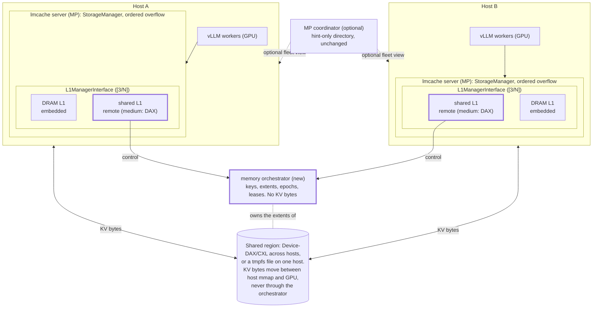
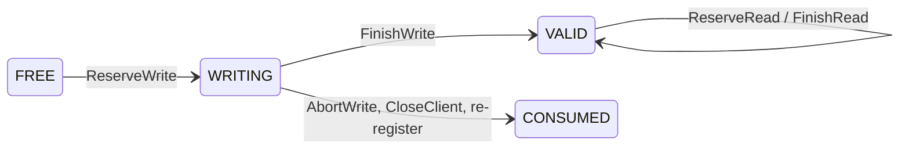

# Memory orchestrator and shared L1

2026-10-07 · Dongjoo Seo

## Scope

Experimental, opt-in, MP mode only. [4/N] of the multi-L1 series after
[#5416](https://github.com/LMCache/LMCache/pull/5416) (ordered overflow, owner
tags), [#5461](https://github.com/LMCache/LMCache/pull/5461) (multi-L1 serving)
and [3/N] (`L1ManagerInterface`, [`distributed/l1_manager_interface.md`](distributed/l1_manager_interface.md)).
It supersedes the `_shared_backend` branches and the FastAPI coordinator of
[#5105](https://github.com/LMCache/LMCache/pull/5105) and implements the
shared-pool profile of [#4307](https://github.com/LMCache/LMCache/issues/4307)
and [#5030](https://github.com/LMCache/LMCache/issues/5030).

Two pieces:

1. **`lmcache memory`, the memory orchestrator.** One process per region owns
   keys, extents, the region epoch, write tokens and read leases behind nine
   batched gRPC calls. It never touches KV bytes and never learns what backs
   the region.
2. **`SharedL1Manager`, the interface's first remote binding.** It maps the
   region through a medium on its host and moves KV bytes between that
   mapping and the GPU: `DevDaxMedium` for a Device-DAX/CXL device several
   hosts attach, `FileMedium` for a tmpfs or hugetlbfs file several servers on
   one host share. Every extent, commit, read lease and release comes from
   the orchestrator.

First-milestone limits: one region per orchestrator, one shared L1 per server,
TP1, `lmcache_driven` transfer, `noop` eviction, monotonic allocation (no
extent reuse), in-memory authority state. Not here: reclamation or eviction
of shared objects, lease TTL and client fencing, authority HA or durability,
hot-plug of the region, fleet cache events for shared placements.

## Why a separate owner

- The pool outlives every server, so its allocator cannot live in one.
- CXL 2.0 multi-host memory has no coherent cross-host atomics, so locks or
  a free list inside the shared bytes cannot arbitrate.
- "This extent is committed" needs one global order, and a writer whose RPC
  timed out cannot fence itself.
- Reclaiming later needs every host's outstanding readers in one place.

| Alternative | Why not |
| --- | --- |
| Index, allocator and locks inside the region ([#5494](https://github.com/LMCache/LMCache/pull/5494)) | Needs cache-coherent mappings; across CXL 2.0 hosts a crashed host can leave locks nobody can safely break |
| One MP server leads | Leader lifetime is not pool lifetime; election is the orchestrator with extra steps |
| Allocation inside the MP coordinator (#4307's proposal) | Its directory is hint-only and eventual by contract; an authority on the per-request path needs its own lifetime and failure domain |
| One partition per host | Pooling, not sharing: a host cannot reuse what another wrote |

The cost is one process per region and two metadata round trips per batch.
Private L1s keep the embedded binding and pay nothing.

## Architecture



Control goes through the orchestrator; KV bytes never do. The MP coordinator
stays optional and unchanged.

| Owner | Owns |
| --- | --- |
| MP server | host-local mapping and DMA registration, copy scheduling, publish/acquire fences, cancellation |
| Embedded L1 | allocator, index, locks, eviction, as today |
| Memory orchestrator | region identity and epoch, extent allocation, object state and layout, write tokens, read leases |
| MP coordinator | registry, hint directory, quota; unchanged |
| Operator | that every server's path names the same physical region; offline resets; one orchestrator per region |

## Protocol

`lmcache/v1/memory_orchestrator/protos/memory_orchestrator.proto`, package
`lmcache.memory_orchestrator.v1`. Every request carries an envelope
(`region_id`, `expected_region_epoch`, `client_id`, `client_incarnation`,
`request_id`); a stale region, epoch or incarnation is refused without a
state change, and a repeated `request_id` from the same incarnation gets the
recorded reply. Batches are capped by `max_batch_entries`; the client splits
larger ones and rolls back a split batch that fails.

| RPC | Does |
| --- | --- |
| `DescribeRegion` | region id, epoch, capacity, alignment, visibility mode, layout fingerprint, batch limit, `reset_required` |
| `RegisterClient` | registers `client_id` with a new incarnation; checks layout fingerprint, mapped bytes and visibility mode; retires the previous incarnation's writes and leases |
| `ReserveWrite` | per new key: `WRITE_GRANTED` (handle + token), `EXISTS_VALID`, `BUSY_WRITING`; `OUT_OF_SPACE` fails the whole batch atomically |
| `FinishWrite` | tokens: `WRITING` to `VALID` |
| `AbortWrite` | tokens: `WRITING` to `CONSUMED`; the extent is never reused |
| `ReserveRead` | per key: `READ_GRANTED` (handle, layout, leases), `MISS`, `BUSY_WRITING` |
| `FinishRead` | releases leases |
| `Usage` | allocated and valid bytes, object, lease and client counts |
| `CloseClient` | retires this incarnation |



- `FinishWrite` is sent only after the D2H copies completed and the publish
  fence ran. Reads are granted on `VALID` only; `VALID` is terminal here.
- A writer that vanished stays `WRITING` until its server registers again
  under the same `client_id` or the region is reset; others see
  `BUSY_WRITING` and recompute.
- Allocation is monotonic, so `generation` stays 1 and nothing a client may
  still write to is ever handed out again.

## Flows

```text
MP A                         orchestrator                      MP B
 |-- ReserveWrite(keys) ------->|                                 |
 |<-- WRITE_GRANTED + handles --|                                 |
 | D2H into local mapping       |                                 |
 | stream callback: publish     |                                 |
 |-- FinishWrite(tokens) ------>| WRITING -> VALID                |
 |                              |<------- ReserveRead(keys) ------|  lookup
 |                              |-- READ_GRANTED + leases ------->|
 |                              |          acquire, H2D copy      |
 |                              |<------- FinishRead(leases) -----|
```

- Duplicate store: one writer gets `WRITE_GRANTED`, the other `BUSY_WRITING`
  and skips; a later store of a committed key gets `EXISTS_VALID` and copies
  nothing. One resident copy per key.
- Lookup is the reservation: the prefetch lock pass asks local L1s first and
  the shared L1 only for the keys they missed, so a DRAM hit costs no round
  trip. `MISS` and `BUSY_WRITING` are ordinary misses.
- Writes follow `--l1-manager` order; list the shared L1 first so stores land
  where every server can read them. Only `OUT_OF_MEMORY` (region full, or
  orchestrator unreachable) moves a key to the next L1.
- A store that fails part-way aborts its reservations on the copy stream
  (`StorageManager.abort_write_by_owner`); for this binding that is an
  `AbortWrite`, without which the key would stay `WRITING` for every server.

## Failure semantics

Everything fails closed and no extent is reused, so no failure corrupts a
reader.

| Failure | Behaviour |
| --- | --- |
| Store fails on the server | Reservations aborted after the partial copies drain; keys writable again |
| Server dies mid-store | Keys stay `WRITING` until it re-registers under its `client_id` or a reset; others recompute meanwhile |
| Server dies holding leases | Leases stay counted until the same retirement; nothing waits on them yet |
| `FinishWrite` times out | Store reported failed; keys stay `WRITING` unless the commit landed, in which case a later `ReserveWrite` sees `EXISTS_VALID` |
| Orchestrator restarts | Startup marker survives, so it comes up `RESET_REQUIRED` with a new epoch; every shared L1 is fenced until its server restarts after an offline reset. Private L1s keep serving |
| Orchestrator unreachable | Reads miss, writes overflow to the next L1, status says unreachable; no local fallback authority |
| Second orchestrator for a region | Refused while the marker names a live process; a dead process's marker starts the new one `RESET_REQUIRED` |
| Layout or visibility mismatch | `RegisterClient` fails; the server does not start the shared L1 |

No lease TTL, automatic abort or client fencing yet: an expired token cannot
prove a remote DMA stopped, so expiry-driven reuse would reintroduce the
corruption the orchestrator exists to prevent. Restart-as-reset is the honest
contract until fencing exists; on a clean stop with no clients the marker is
deleted, so a planned restart needs no reset.

## Visibility and media

With `visibility_mode = software_fenced` (CXL 2.0 across hosts) the server
fences both sides of every copy; the orchestrator trusts the fences.

- Publish: after the D2H copy, `clflushopt` the range and `sfence`, then
  `FinishWrite`. Intel DDIO can leave DMA-written lines in the writer's LLC,
  so this is not optional.
- Acquire: after `READ_GRANTED`, `clflushopt` the range and `sfence` before
  the H2D copy. `lfence` would not order `clflushopt` against the copy's
  doorbell write.
- Both run in the native `lmcache_native.cache_flush_range` (x86-64,
  `clflush` + `mfence` fallback), GIL released, up to eight threads per batch.
- `coherent` skips both: one host, or a coherent fabric. The orchestrator
  advertises the mode and refuses a client with a different one.

A medium (`shared_l1/media.py`) maps the first `capacity_bytes` of its path
with the same `open_devdax_mapping` helper the private Device-DAX allocator
uses, registers the mapping for GPU DMA (`direct-pinned`, else
`pageable-staging` through pageable memory) and builds bounds-checked
memory-object views at granted offsets. `DevDaxMedium` requires a character
device and checks its sysfs size; `FileMedium` creates or extends the file to
the capacity so any server can start first. The L1 type picks the medium:
`DEVDAX` maps a device, `DRAM` maps a file; GDS cannot be shared.

## Configuration and guards

```bash
lmcache memory --region-id pool-a --capacity-gb 512 --alignment 2M \
    --visibility-mode software_fenced --listen 0.0.0.0:7700 \
    --state-dir /var/lib/lmcache/memory/pool-a

# CXL region shared across hosts, private DRAM as overflow
lmcache server --supported-transfer-mode lmcache_driven --eviction-policy LRU \
    --l1-manager '{"type":"DEVDAX","tag":"cxl","size_gb":512,"path":"/dev/dax0.0",
                   "shared":{"orchestrator":"10.0.0.5:7700","region_id":"pool-a"}}' \
    --l1-manager '{"type":"DRAM","tag":"_default","size_gb":60}'

# tmpfs region shared by several servers on one host (orchestrator: --visibility-mode coherent)
lmcache server --supported-transfer-mode lmcache_driven \
    --l1-manager '{"type":"DRAM","tag":"pool","size_gb":64,"path":"/dev/shm/pool-a",
                   "shared":{"orchestrator":"127.0.0.1:7700","region_id":"pool-a"}}'
```

`shared` takes `orchestrator`, `region_id`, an optional `client_id` (default
`<hostname>-<machine-id prefix>:<MP port>`, stable across restarts) and
`rpc_timeout_seconds` (default 5). `size_gb` must be at least the region
capacity. A shared L1 defaults to, and requires, `noop` eviction.

Guards, before the shared L1 serves anything: `DescribeRegion` reachable and
not `RESET_REQUIRED`, region fits `size_gb`, `RegisterClient` accepted;
`--supported-transfer-mode lmcache_driven`; no CacheBlend, P2P or
experimental modules; TP1 (checked when an engine registers its KV cache);
at most one shared L1 per server and no L2 `affinity_tag` on it; `lmcache
trace replay` refuses it; its placements carry `shared: true` and stay out
of fleet cache events. Reset is offline: stop every server, stop the
orchestrator, remove the marker, start both again.

## Code map

- `lmcache/v1/memory_orchestrator/`: `state.py` (region state machine),
  `service.py` (gRPC servicer, reply window), `server.py` (CLI, startup
  marker), `client.py` (deadlines, retries, batch splitting), `api.py`,
  `_codec.py`, `protos/`. CLI entry: `lmcache/cli/commands/memory.py`.
- `lmcache/v1/distributed/shared_l1/`: `manager.py` (`SharedL1Manager`),
  `media.py` (`RegionMedium`, `DevDaxMedium`, `FileMedium`), `visibility.py`,
  `wire.py`. Native flush: `csrc/lmcache_native/cache_flush.{h,cpp}`.
- Wiring: `config.py` (`shared` on `L1ManagerConfig`), `storage_manager.py`
  (`_create_l1_manager`, `has_remote_l1`), `prefetch_controller.py` (lock
  pass order), `multiprocess/server.py` (`prepare_shared_l1`),
  `lmcache_driven_transfer.py` (TP guard), `mp_coordinator/cache_events.py`,
  `trace/replay_command.py`. Build: `_proto_gen/_generate.py`, `setup.py`.

## Tests

Every test that touches the orchestrator spawns the real process.

| File | Proves |
| --- | --- |
| `tests/v1/memory_orchestrator/test_state.py` | state machine: one writer per key, reads on `VALID` only, atomic `OUT_OF_SPACE`, monotonic allocation, token idempotency, stale epoch/incarnation refused, retirement, `RESET_REQUIRED` |
| `tests/v1/memory_orchestrator/test_server.py` | the process over gRPC: full flow, idempotent replay, startup marker, batch splitting and rollback |
| `tests/v1/distributed/shared_l1/test_manager.py` | `SharedL1Manager`: cross-server reads, one writer per key, abort, overflow, leases, refused delete/evict, crash-restart retirement, unreachable and restarted orchestrator |
| `tests/v1/distributed/shared_l1/test_media.py` | views, bounds, file create/extend, device check, medium per L1 type |
| `tests/v1/distributed/shared_l1/test_storage_manager_binding.py` | `StorageManager` builds the remote binding from a `shared` config; `DEVDAX` needs a device |
| `tests/v1/distributed/shared_l1/test_two_process.py` | two processes map one file at different addresses; a writer killed mid-store leaves a busy key |
| `tests/v1/distributed/shared_l1/test_config.py`, `test_server_guards.py` | parsing and the guards |
| `tests/v1/distributed/shared_l1/test_visibility.py` | native flush and the two modes |
| `tests/v1/distributed/test_l1_interface.py` | [3/N]'s contract, now against the remote binding too |
| `tests/v1/distributed/test_l1_lookup_order.py` | local L1s first, the shared L1 only for misses |
| `tests/v1/multiprocess/test_shared_l1_servers.py` (GPU) | two MP servers on one host share a tmpfs region through D2H/H2D |

Two-host qualification on a CXL 2.0 switch rig (2026-10-07, by hand): the
two hosts' Device-DAX devices were shown to alias with a flushed marker probe;
chunks stored by either host were retrieved by the other with identical
SHA-256 (6/6 each way); a duplicate store allocated nothing. Stale-line
provocation: `software_fenced` 48/48 correct, `coherent` 0/48, and with the
reader flushed cold `coherent` still corrupted 40/48, so the writer-side
(DDIO) flush is required on its own. Not covered: vLLM serving across hosts
(#5105's 2P4D/4P2D matrix).

## Follow-ups

| Follow-up | Adds |
| --- | --- |
| Lease TTL and client fencing | `Renew`; an orphaned extent is quarantined until its incarnation is fenced |
| Reclamation and eviction | `RequestEvict`, `VALID -> EVICTING -> FREE`, generation bump on reuse |
| Several regions per orchestrator | region table keyed by `region_id`; no wire change |
| Other media | a medium that copies through cuFile (GDS slab), Maru's resource manager |
| Fleet events for shared placements | region-scoped `STORE`/`DELETE` events from the orchestrator |
| Visibility without flushes | uncacheable mapping plus DDIO off, measured against `software_fenced` |
